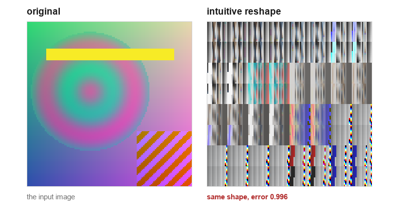
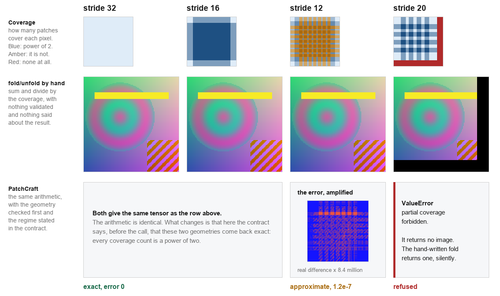
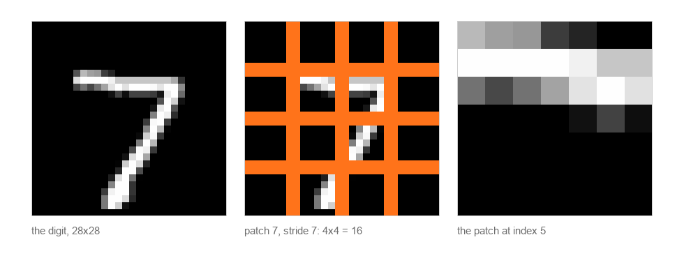

<!-- l10n: doc_id=patchcraft-outreach-pagina · lang=en · translation_of=pagina.md · source_lang=pt-BR -->
**English** · [Português](pagina.md)

# Cutting an image into patches, processing, and putting it back

An illustrated page to assemble into any channel. The images live in
[`figuras/en/`](figuras/en/) and can be reordered or used on their own. Nothing here is
drawn: each panel is the tensor that path returns, and every figure comes out of
`python tools/make_outreach_figures.py`.

To a computer an image is a matrix of numbers. A large image rarely goes into a neural
network whole: it is cut into pieces, each piece is processed, and at the end everything is
glued back. The pieces are called patches, and the distance the window travels from one patch
to the next is the stride.

## 1. The cut (unfold) and the reassembly (fold)



PyTorch's `unfold` slides a window across the image and returns every window stacked, but not
in the order it looks. It flattens channel, patch row and patch column into a single
dimension, shaped `(1, C·ph·pw, L)`, and leaves the number of patches at the end.

Reading that directly as `(L, C, ph, pw)` gives the right shape and the wrong order. That is
the panel on the right: the same pixels, in moved positions, and nothing raised.

The way back, `fold`, adds each window into the place it came from. Where patches overlap it
adds more than once, so putting the image back means dividing each pixel by the number of
times it was covered. That count is the coverage map, the first row of the next figure.

## 2. The stride decides the result



At strides 32 and 16 both paths return the same tensor, and it is exact. Worth saying plainly:
PatchCraft's arithmetic is the same. What it adds is checking the geometry first and declaring
the regime, not summing differently.

At stride 12 the round trip is approximate. Its coverage counts include 3, 6 and 9, and
dividing a float by anything that is not a power of two rounds. The error map draws exactly
the grid of those regions, which are the amber ones in the first row. The error is 1.2e-7, it
is small, and it is declared in the contract rather than discovered afterwards.

At stride 20 the two paths genuinely diverge. The grid ends at pixel 112 of 128, and the
hand-written `fold` returns an image with 3840 pixels at zero, raising nothing. `reconstruct`
refuses, with a message that names the numbers and points at `patchcraft.tilings`, which lists
the geometries that close.

## 3. On a typical image



An MNIST digit is 28 by 28. At patch 7 and stride 7, 28 divided by 7 is exactly 4, and the
grid covers the digit with nothing left over and no overlap: every coverage count is 1, and
the round trip is bit for bit identical.

It is the commonest case and the only one with nothing to decide. The three problems above
appear when the stride stops dividing the side of the image.

## Reproduction

```
pip install patchcraft
python tools/make_outreach_figures.py
```

Repository: https://github.com/LeoPR/PatchCraft
