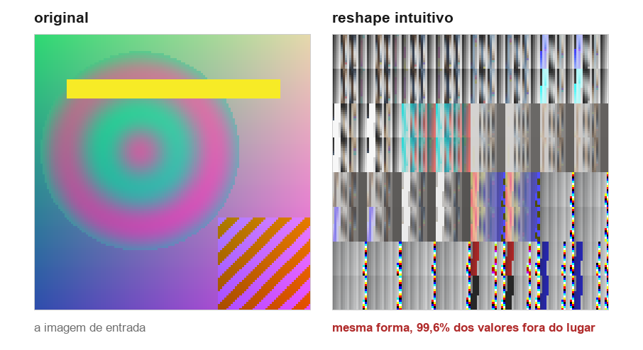
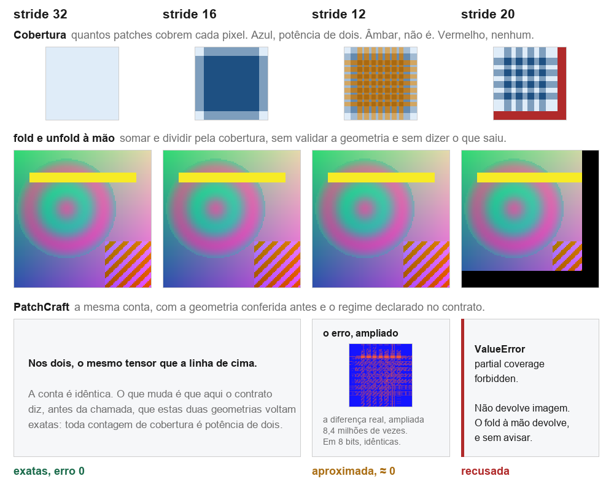
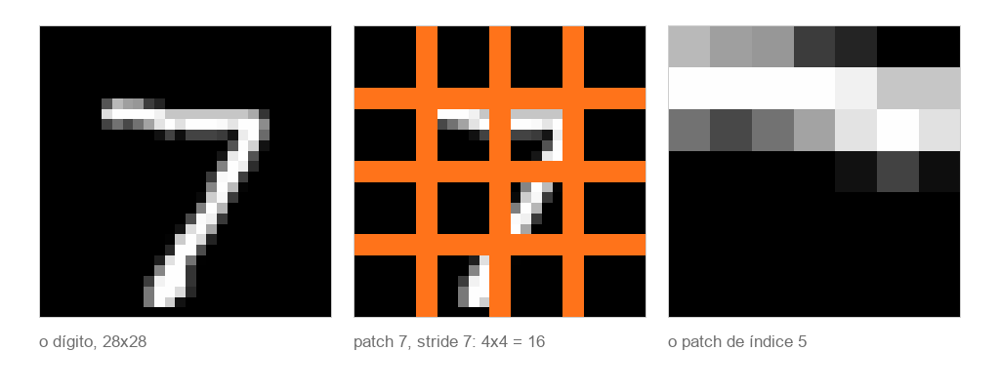

<!-- l10n: doc_id=patchcraft-outreach-pagina · lang=pt-BR · canonical -->
**Português** · [English](page.md)

# Recortar uma imagem em patches, processar, e remontar

Página ilustrada para montar em qualquer canal. As imagens ficam em
[`figuras/pt-BR/`](figuras/pt-BR/) e podem ser reordenadas ou usadas soltas. Nada aqui é
desenhado: cada painel é o tensor que aquele caminho devolve, e todas as figuras saem de
`python tools/make_outreach_figures.py`.

Para o computador, uma imagem é uma matriz de números. Uma imagem grande raramente entra
inteira numa rede neural: ela é cortada em pedaços, cada pedaço é processado, e no fim tudo é
colado de volta. Os pedaços se chamam patches, e a distância que a janela anda de um patch
para o próximo é o stride.

## 1. O recorte (unfold) e a remontagem (fold)



O `unfold` do PyTorch percorre a imagem com uma janela e devolve todas as janelas empilhadas,
mas não na ordem que parece. Ele achata canal, linha e coluna do patch numa dimensão só, na
forma `(1, C·ph·pw, L)`, e deixa o número de patches no fim.

Ler isso direto como `(L, C, ph, pw)` pede a forma certa, e o tensor tem mesmo essa forma,
então nada reclama. O que muda é a ordem em que os números são lidos do buffer, e o
resultado é o painel da direita.

Vale ser exato sobre o que aconteceu ali, porque a aparência engana nos dois sentidos. **Não
é perda: é uma permutação.** O conjunto de valores é idêntico ao da imagem original, pixel
por pixel, e nada foi destruído nem arredondado. O que se perdeu foi só a correspondência
entre cada valor e a posição dele, e 99,6% dos valores acabam numa posição que não é a sua.
Toda posição de pixel da imagem recebe um valor que não era o dela.

É por isso que o defeito é silencioso e não um acidente barulhento. O tensor continua tendo
a forma certa, o dtype certo e a mesma distribuição de valores, então ele passa em qualquer
verificação de sanidade, o treino roda, e a perda desce um pouco menos.

A volta, o `fold`, soma cada janela no lugar de origem. Onde os patches se sobrepõem ela soma
mais de uma vez, então remontar exige dividir cada pixel pelo número de vezes que ele foi
coberto. Essa contagem é o mapa de cobertura, a primeira linha da figura seguinte.

## 2. O stride decide o resultado



A figura tem três linhas e quatro strides. A de cima é o mapa de cobertura, quantos patches
cobrem cada pixel, com azul onde a contagem é potência de dois e âmbar onde não é. A do meio
é o `fold` e o `unfold` escritos à mão, somando e dividindo pela cobertura, sem validar a
geometria e sem dizer o que saiu. A de baixo é o PatchCraft, com a mesma conta e a geometria
conferida antes.

Nos strides 32 e 16 os dois caminhos devolvem o mesmo tensor, e ele é exato. Vale dizer com
todas as letras: a conta do PatchCraft é a mesma. O que ele acrescenta é conferir a geometria
antes e declarar o regime, não somar diferente.

No stride 12 a volta é aproximada. As contagens de cobertura dele incluem 3, 6 e 9, e dividir
um float por um número que não é potência de dois arredonda. O mapa do erro desenha exatamente
a grade dessas regiões, que são as âmbar da primeira linha.

A figura marca esse caso como `≈ 0` porque é o que ele significa na prática, e aqui vai o
número com a medida ao lado. O erro máximo é `1,1921e-07`, o que dá 151,5 dB de PSNR quando
40 dB já costuma ser tratado como visualmente sem perda. Ele cabe 32.897 vezes dentro de um
degrau de 8 bits, então convertendo as duas imagens para `uint8` elas saem bit a bit
idênticas; só em 16 bits a diferença aparece.

Nada disso torna o erro irrelevante, e é por isso que o contrato o declara: quem soma
milhares de patches, ou encadeia a operação, acumula. O ponto é que "aproximada" aqui
significa abaixo do que qualquer olho ou arquivo de 8 bits registra, e não uma imagem
degradada.

No stride 20 os dois caminhos divergem de verdade. A grade termina no pixel 112 de 128, e o
`fold` escrito à mão devolve uma imagem com 3840 pixels em zero, sem levantar nada. O
`reconstruct` recusa, com uma mensagem que nomeia os números e aponta para `patchcraft.tilings`,
que lista as geometrias que fecham.

## 3. Numa imagem típica



Um dígito do MNIST tem 28 por 28. Com patch 7 e stride 7, 28 dividido por 7 dá 4 exato, e a
grade cobre o dígito sem sobra e sem sobreposição: toda contagem de cobertura vale 1, e a
volta é bit a bit idêntica.

É o caso mais comum e o único em que não há nada a decidir. Os três problemas acima aparecem
quando o stride deixa de dividir o lado da imagem.

## Reprodução

```
pip install patchcraft
python tools/make_outreach_figures.py
```

Repositório: https://github.com/LeoPR/PatchCraft
